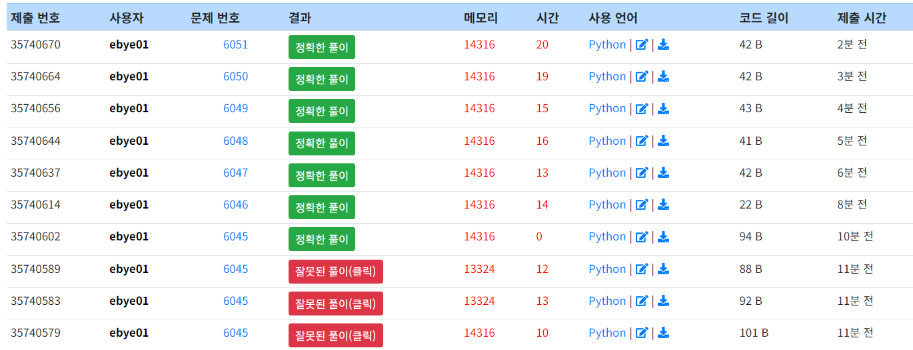
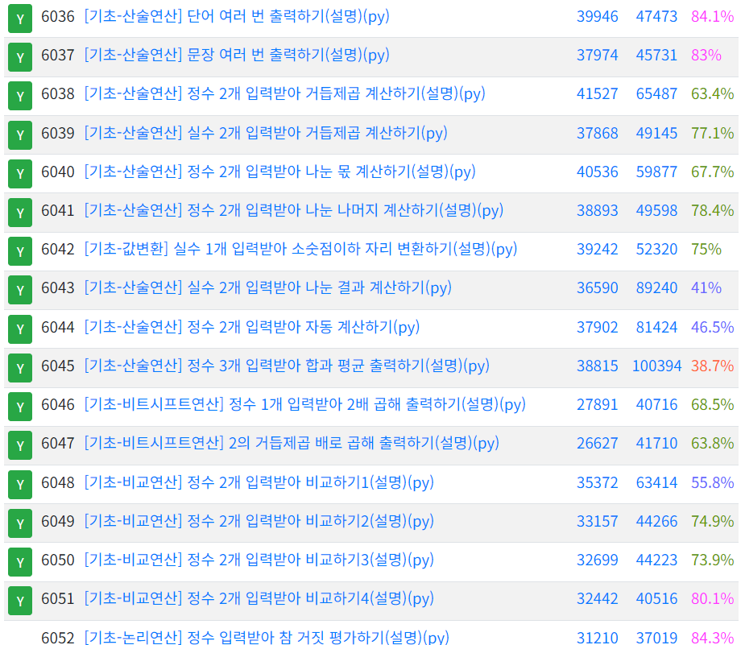

## 0126 TIL
### 코드업 기초 98문제 중 [기초-출력] 43문제 풀이 완료 [총 51문제 풀이 완료]

#### print(int(input())) 이런 형태로 변수 입력 가능하다
#### a=input()  b=input()  print(b+"\n"+a)
#### a, b=input().split() -> 1 2 입력하면 a=1, b=2로 저장됨
#### input().split(':') 를 사용하면 콜론 ':' 기호를 기준으로 자른다.
#### print(?, ?, sep=':') 를 사용하면 콜론 ':' 기호를 사이에 두고 값을 출력한다.
#### sep 는 분류기호(seperator)를 의미한다.
#### 아무것도 없는 공(empty) 문자는 작은 따옴표(') 2개를 붙여서 '' 로 표현한다.
#### s[a:b] 라고 하면, s라는 단어에서 a번째 문자부터 b-1번째 문자까지 잘라낸 부분을 의미한다.
#### print('%x'% n)  #n에 저장되어있는 값을 16진수(hexadecimal) 소문자 형태 문자열로 출력
#### a = input(), n = int(a, 16) #입력된 a를 16진수로 인식해 변수 n에 저장
#### print('%o' % n)  #n에 저장되어있는 값을 8진수(octal) 형태 문자열로 출력
#### n = ord(input())  #입력받은 문자를 10진수 유니코드 값으로 변환한 후, n에 저장한다. ord( ) 는 어떤 문자의 순서 위치(ordinal position) 값을 의미한다. 실제로 각각의 문자들에는 연속된 정수 값이 순서에 따라 부여 되어 있다. A:65, B:66, C:67 .... ord(c) : 문자 c 를 10진수로 변환한 값 
#### chr( )는 정수값->문자, ord( )는 문자->정수값 형태로 바꿔주는 서로 반대 방향으로 바꾸어 주는 기능을 한다.
#### python 언어에서는 거듭제곱을 계산하는 연산자(**)를 제공한다.
#### python언어에서는 나눈 몫을 계산하는 연산자(//, floor division)를 제공한다. a//b 와 같이 작성하면, a를 b로 나눈 몫(quotient)을 계산해준다.
#### format(수, ".2f") 를 사용하면 원하는 자리까지의 정확도로 반올림 된 실수 값을 만들어 준다. 여기서 만들어진 값은 소수점 아래 3번째 자리에서 반올림한 값이다.
#### 왼쪽 비트시프트(<<)가 될 때에는 오른쪽에 0이 주어진 개수만큼 추가되고, 오른쪽 비트시프트(>>)가 될 때에는 왼쪽에 0(0 또는 양의 정수인 경우)이나 1(음의 정수인 경우)이 개수만큼 추가되고, 가장 오른쪽에 있는 1비트는 사라진다.
##### 예시 n = 10 
##### print(n<<1)  #10을 2배 한 값인 20 이 출력된다.
##### print(n>>1)  #10을 반으로 나눈 값인 5 가 출력된다.
##### print(n<<2)  #10을 4배 한 값인 40 이 출력된다.
##### print(n>>2)  #10을 반으로 나눈 후 다시 반으로 나눈 값인 2 가 출력된다.
#### 비교/관계연산자도 일반적인 사칙연산자처럼 주어진 두 수를 이용해 계산을 수행하고, 그 결과를 True(참), 또는 False(거짓)로 계산해 주는 연산자이다.
#### 비교/관계연산자는 <, >, <=, >=, ==(같다), !=(다르다) 6개가 있다.
#### True(참) 또는 False(거짓) 값으로만 표현하고 저장하는 값을 불(bool)/불리언(boolean) 값이라고 한다.

