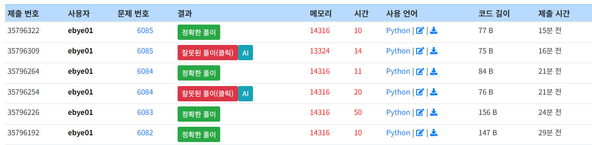
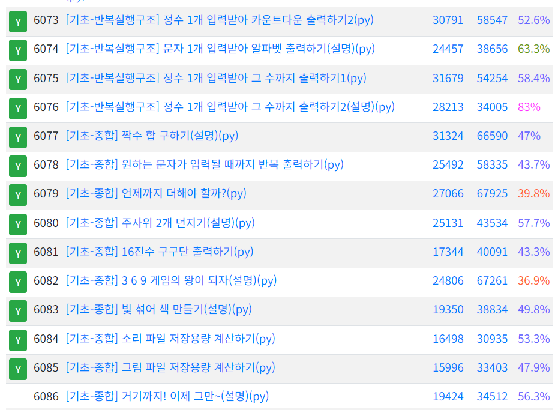

## 0202 TIL
### 코드업 기초 98문제 중 [기초-출력] 34문제 풀이 완료 [총 85문제 풀이 완료]

#### bool( ) 을 이용하면 입력된 식이나 값을 평가해 불 형의 값(True 또는 False)을 출력해준다.
#### 식이나 값을 계산해서 결과값이 만들어지는 것을 평가(evaluate)라고 한다.
#### python 언어에서 정수값 0은 False(거짓)로 평가되고, 그 외의 값들은 모두 True(참)로 평가된다.
#### 참 또는 거짓의 논리값을 역(반대)으로 바꾸기 위해서 not 예약어(reserved word, keyword)를 사용할 수 있다.
#### 이러한 논리연산을 NOT 연산(boolean NOT)이라고도 부르고, 프라임 '(문자 오른쪽 위에 작은 따옴표), 바(기호 위에 가로 막대), 문자 오른쪽 위에 c(여집합, complement) 등으로 표시한다. 
#### and 예약어는 주어진 두 불 값이 모두 True 일 때에만 True 로 계산하고, 나머지 경우는 False 로 계산한다.
#### 이러한 논리연산을 AND 연산(boolean AND)이라고도 부르고, · 으로 표시하거나 생략하며, 집합 기호 ∩(교집합, intersection)로 표시하기도 한다. 
#### or 예약어는 주어진 두 불 값 중에서 하나라도 True 이면 True 로 계산하고, 나머지 경우는 False 로 계산한다.
#### 이러한 논리연산을 OR 연산(boolean OR)이라고도 부르고, + 로 표시하거나, 집합 기호 ∪(합집합, union)로 표시하기도 한다.
#### 참 거짓이 서로 다를 때에만 True 로 계산하는 논리연산을 XOR(exclusive or, 배타적 논리합) 연산이라고도 부른다.
#### 입력 된 정수를 비트단위로 참/거짓을 바꾼 후 정수로 출력하려면 비트단위(bitwise)연산자 ~ 를 붙이면 된다.(~ : tilde, 틸드라고 읽는다.)
#### 비트단위(bitwise) 연산자는 ~(bitwise not), &(bitwise and), |(bitwise or), ^(bitwise xor), <<(bitwise left shift), >>(bitwise right shift)가 있다.
#### 입력된 정수 두 개를 비트단위로 and 연산한 후 그 결과를 정수로 출력하려면 비트단위(bitwise)연산자 &를 사용하면 된다.(and, ampersand, 앰퍼센드라고 읽는다.)
#### 입력된 정수 두 개를 비트단위로 or 연산한 후 그 결과를 정수로 출력하려면 비트단위(bitwise) 연산자 |(or, vertical bar, 버티컬바)를 사용하면 된다.  | 은 파이프(pipe)연산자라고도 불리는 경우가 있다.
#### 입력된 정수 두 개를 비트단위로 xor 연산한 후 그 결과를 정수로 출력하려면 비트단위(bitwise) 연산자 ^(xor, circumflex/caret, 서컴플렉스/카릿)를 사용하면 된다.
####  주의 ^은 수학식에서 거듭제곱(power)을 나타내는 기호와 모양은 같지만, C언어에서는 전혀 다른 배타적 논리합(xor, 서로 다를 때 1)의 의미를 가진다.
#### 3개의 요소로 이루어지는 3항 연산은 "x if C else y" 의 형태로 작성이 된다.
#### - C : True 또는 False 를 평가할 조건식(conditional expression) 또는 값
#### - x : C의 평가 결과가 True 일 때 사용할 값
#### - y : C의 평가 결과가 True 가 아닐 때 사용할 값
#### if 조건식 : 
#### 실행1  #조건식의 평가값이 True 인 경우 실행시킬 명령을 들여쓰기를 이용해 순서대로 작성한다.
#### 실행2  #논리적으로 한 단위로 처리해야하는 경우 콜론(:)을 찍고, 들여쓰기로 작성 한다.
#### 실행3  #들여쓰기를 하지 않은 부분은 조건식에 상관이 없음 
#### elif는 else if 의 짧은 약어
#### 알파벳 문자 a의 정수값은 ord('a')로 알아낼 수 있다. chr(정수값)을 이용하면 유니코드 문자로 출력할 수 있다.
#### print(..., end=' ') 와 같이 작성하면 값 출력 후 공백문자 ' '를 출력한다. 즉, 마지막에 줄을 바꾸지 않고 빈칸만 띄운다. (end='\n'로 작성하거나 생략하면, 값을 출력한 후 마지막(end)에 줄바꿈(newline)이 된다.)
#### range(n) 은 0, 1, 2, ... , n-2, n-1 까지의 수열을 의미한다. 예를 들어 range(3) 은 0, 1, 2 인 수열을 의미한다. for i in range(n) :    #range(n)에 들어있는(in) 각각의 수에 대해서(for) 순서대로 i에 저장해 가면서 이때의 for는 각각의 값에 대하여라는 for each 의 의미를 가진다고 생각할 수 있다.

