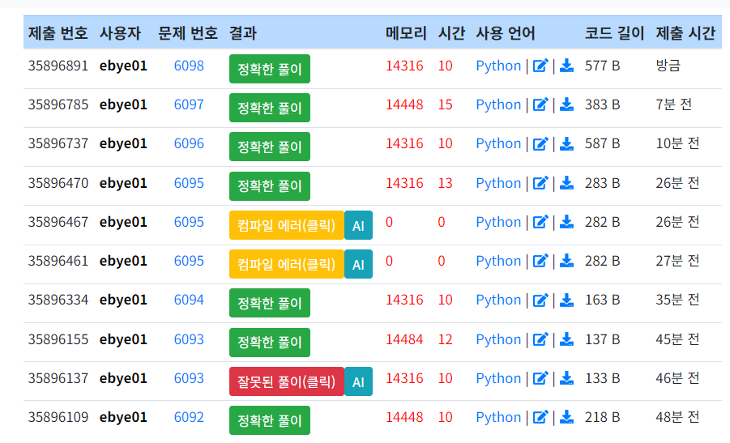
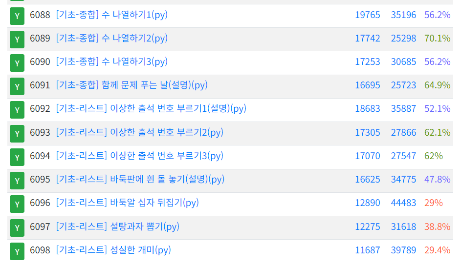

## 0217 TIL
### 코드업 기초 98문제 중 [기초-출력] 14문제 풀이 완료 [총 98문제 풀이 완료]

#### 조건문이나 반복문의 코드블록 안에서 break 가 실행되면, 반복실행을 중단(break)하고, 가장 가까운 반복 블록의 밖으로 빠져나간다.

### 파이썬을 이용하여 계산기 프로그램 만들기
#### - 계산기에서 필요한 수학 알고리즘을 백준에서 공부
